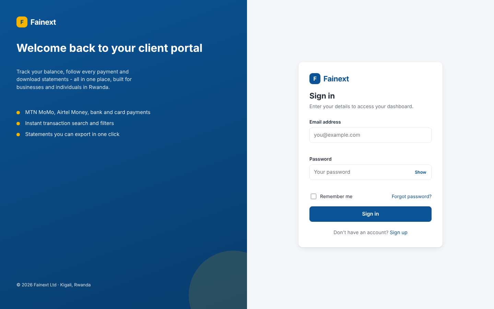
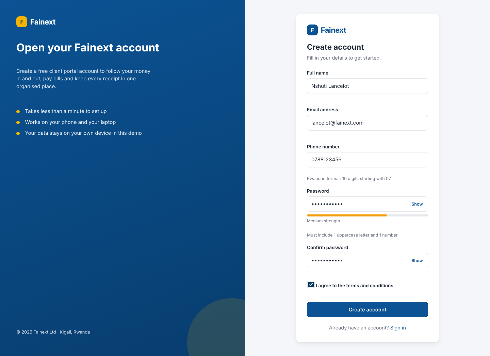
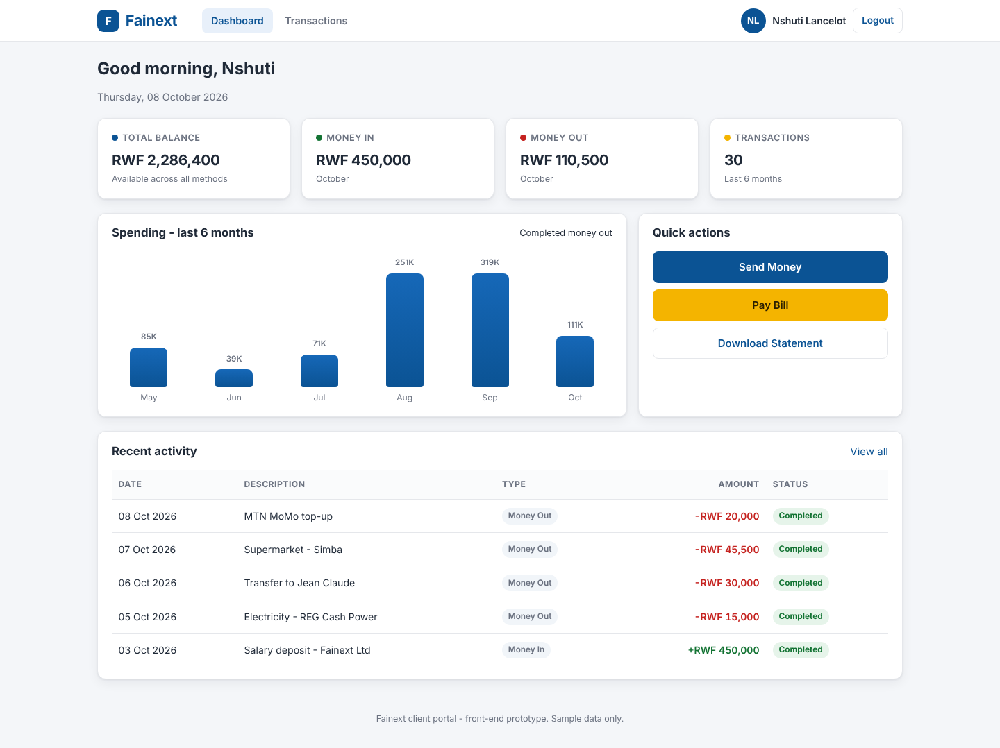
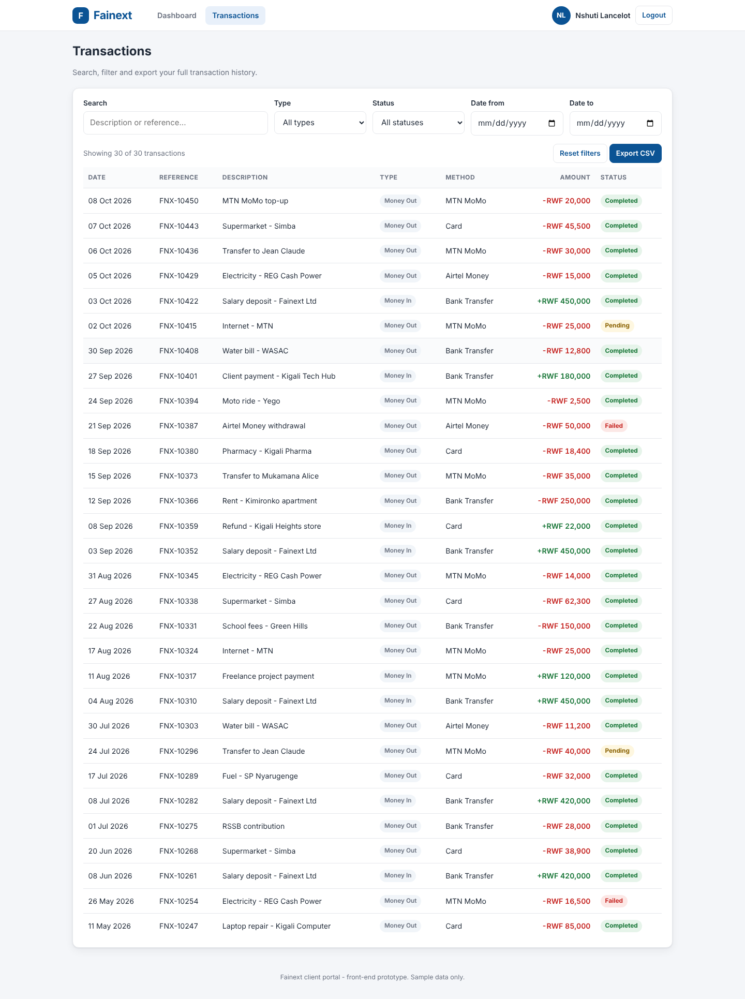

# Fainext Client Portal

A front-end demo of a client portal for **Fainext**, a Rwandan financial services
company. It covers the full client journey — registration, login, a dashboard with
balances and spending, and a searchable, filterable, exportable transaction history.

Built with **plain HTML, CSS and vanilla JavaScript only**: no frameworks, no npm,
no build step, no CDNs. Every page runs by double-clicking `index.html` and works
unchanged on GitHub Pages.

---

## Features

**Authentication**
- Registration with full name, email, Rwandan phone number, password and terms
- Live password strength bar (weak / medium / strong)
- Passwords hashed with the Web Crypto API (SHA-256) before being stored
- Login with email + password, "Remember me" and a Show/Hide password toggle
- Per-field validation with red inline error messages
- Duplicate-email check on registration
- Protected pages: the dashboard and transactions redirect to login without a session

**Dashboard**
- Time-aware greeting ("Good morning / afternoon / evening, [first name]") and today's date
- Four summary cards: Total Balance, Money In (this month), Money Out (this month),
  Total Transactions — all in Rwandan Francs, formatted `RWF 1,250,000`
- Six-month spending bar chart built from plain HTML/CSS `div`s — no chart library
- Recent Activity table: the 5 latest transactions with colour-coded amounts and
  status badges (Completed / Pending / Failed)
- Quick Actions panel: Send Money, Pay Bill, Download Statement

**Transactions**
- Full table: Date, Reference, Description, Type, Method, Amount, Status
- Payment methods: MTN MoMo, Airtel Money, Bank Transfer, Card
- Five filters that all work together and update instantly: search (description or
  reference), type, status, date from, date to
- Live "Showing X of Y transactions" counter and a "No transactions found" empty state
- **Export CSV** — downloads exactly the rows currently visible

**Design**
- Primary `#0b5394`, accent `#f4b400`, light grey background `#f4f6f9`
- White cards, soft shadows, rounded corners, system font stack
- Fully responsive: two-column auth pages stack on mobile, cards reflow, tables scroll

---

## Tech used

| Layer | Choice |
|---|---|
| Markup | HTML5 |
| Styling | CSS3 (custom properties, Flexbox, Grid, media queries) |
| Logic | Vanilla JavaScript (ES5-compatible syntax, no modules) |
| Storage | `localStorage` |
| Hashing | Web Crypto API — `crypto.subtle.digest("SHA-256", …)` |
| Export | `Blob` + object URL (no library) |
| Wireframes | Hand-written SVG |

No dependencies, no package manager, no internet connection required.

---

## How to run

**Locally** — clone or download the folder, then open `index.html` in any modern
browser. That is the whole setup.

```bash
git clone https://github.com/<your-username>/fainext-portal.git
cd fainext-portal
# then open index.html
```

**Live demo (GitHub Pages)**

> https://&lt;your-username&gt;.github.io/fainext-portal/

Replace `<your-username>` once Pages is enabled on the repository.

**First time through:** there are no pre-seeded accounts. Open `register.html`
(or click "Sign up" on the login page), create an account, then sign in with it.

---

## Folder structure

```
fainext-portal/
├── index.html              Login page
├── register.html           Registration page
├── dashboard.html          User dashboard (protected)
├── transactions.html       Transactions page (protected)
├── css/
│   └── style.css           One shared stylesheet
├── js/
│   ├── auth.js             Login, registration, session + page protection
│   ├── data.js             Sample transactions, formatters, shared table rows
│   ├── dashboard.js        Greeting, summary cards, chart, recent activity
│   └── transactions.js     Filters, table rendering, CSV export
├── wireframes/
│   ├── login.svg           Low-fidelity wireframe (1440 × 900)
│   ├── dashboard.svg       Low-fidelity wireframe (1440 × 900)
│   └── transactions.svg    Low-fidelity wireframe (1440 × 900)
├── screenshots/            Screenshots used in this README
└── README.md
```

### Wireframes

The three SVGs in `wireframes/` are greyscale, low-fidelity layouts matching the
real screens. They open directly in a browser and can be dragged straight into
Figma, where each box imports as an editable vector layer.

---

## Screenshots

| Screen | Preview |
|---|---|
| Login |  |
| Registration |  |
| Dashboard |  |
| Transactions |  |

> Drop your own `login.png`, `register.png`, `dashboard.png` and
> `transactions.png` into the `screenshots/` folder to fill these in.

